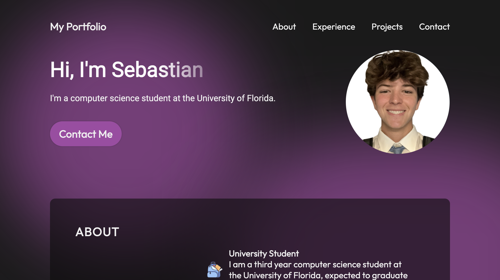

# Personal Portfolio Website

This is a personal portfolio website built with **React** and **Vite**. It features a responsive design, showcasing skills, projects, and contact information in an interactive, modern layout. The site uses a **black and purple** theme for a sleek, professional look.

## Features
- **Responsive Design**: Mobile-first approach for all screen sizes.
- **Interactive Elements**: Animated buttons, hover effects, and scroll animations.
- **Projects Section**: Showcasing personal projects with detailed descriptions.
- **Themed with CSS Variables**: Easily adaptable design with custom variables for colors, fonts, and more.

## Tech Stack
- **React**: Front-end framework for building the user interface.
- **Vite**: Fast and efficient build tool for development.
- **Framer Motion**: Provides animations and transitions.
- **CSS Modules**: For scoped, reusable styles.
  
## Development

**After cloning the repository, you can run**:
   ### `npm start`
This opens a developmental version of the website locally, and from there you can test any changes.

Currently, two official plugins are available:

- [@vitejs/plugin-react](https://github.com/vitejs/vite-plugin-react/blob/main/packages/plugin-react/README.md) uses [Babel](https://babeljs.io/) for Fast Refresh
- [@vitejs/plugin-react-swc](https://github.com/vitejs/vite-plugin-react-swc) uses [SWC](https://swc.rs/) for Fast Refresh
